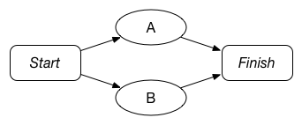

# Task.framework

Task is a simple Cocoa framework for expressing and executing your application’s workflows. Using
Task, you need only express each step in your workflow — called tasks — and what their prerequisite
tasks are. After that, the framework handles the mechanics of executing the steps in the correct
order with the appropriate level of concurrency, letting you know when tasks finish or fail. It also
makes it easy to cancel tasks, retry failed tasks, and re-run previously completed tasks and
workflows.


## What’s New in 1.1

Task 1.1 is a significant update that makes it easier for Task subclasses to get prerequisite
results and respond to state changes.

### Keyed Prerequisites

When adding a task to a workflow, prerequisites can be given unique keys that can be used to
retrieve their results. For example,

```objc
TSKWorkflow *workflow = …;
TSKTask *taskA = …;
TSKTask *taskB = …;
TSKTask *taskC = …;

…

[workflow addTask:taskC keyedPrerequisiteTasks:@{ @"userTask" : taskA, @"projectTask" : taskB }];
```

Later, `taskC` can access the results of `taskA` and `taskB`, e.g., in its `‑main` method, using
`‑[TSKTask prerequisiteResultForKey:]`:

```objc
- (void)main
{
    User *user = [self prerequisiteResultForKey:@"userTask"];
    Project *project = [self prerequisiteResultForKey:@"projectTask"];
    …
}
```

Tasks can even specify which keys they require to run by overriding `‑requiredPrerequisiteKeys`. If
this requirement is not fulfilled when a task is added to a workflow, an assertion is raised.


### Task Subclass Interface

We’ve also added numerous methods to `TSKTask` so that subclasses can respond to changes in task 
state:
 
* `didCancel`
* `didReset`
* `didRetry`
* `didFinishWithResult:`
* `didFailWithError:`

While the default implementations of these methods do nothing, subclasses can override them to
perform necessary actions upon state changes. This should obviate the need for `TSKTask` subclasses
to observe notifications posted by their superclass.


## Features

* Simple, well-documented Objective-C API
* Flexible system for expressing your app’s workflows in a clear, concise manner
* Powerful execution system that allows you to easily manage your workflow’s execution
    * Tasks are started as soon as all their prerequisites have finished successfully
    * Tasks that have no cross-dependencies are executed concurrently
    * Tasks and their dependents can be easily cancelled or retried
    * Tasks that previously finished successfully can be reset and re-run
* Strong task state reporting so that you know when a task succeeds, fails, or is cancelled
* Block and selector tasks for creating tasks that execute a block or method
* External condition tasks for representing prerequisite user interaction or other external
  conditions that must be fulfilled before work can continue
* Subworkflow tasks for executing whole workflows as a single step in a workflow
* Easy-to-extend API for creating your own reusable tasks
* Works with both iOS and OS X


## Installation

The easiest way to start using Task is to install it with CocoaPods.

```ruby
pod 'Task', '~> 1.1'
```

You can also build it and include the built products in your project. For OS X and iOS 8, just add
`Task.framework` to your project. For older versions of iOS, add Task’s public headers to your
header search path and link in `libTask.a`, all of which can be found in the project’s build output
directory.


## Using Task

The Task framework makes it easy to express your app’s workflows and manage the various tasks within
them. There are two types of objects in the framework: `TSKTasks` represent the individual steps in
a workflow, while `TSKWorkflows` represent the workflows themselves. Tasks are defined by the work
they do and their current state; workflows are defined by the tasks they contain and the
relationships between them. Tasks are not particularly useful without workflows. 

While `TSKTask` and `TSKWorkflow` seem similar to `NSOperation` and `NSOperationQueue`, they
represent very different concepts. Operations model *single executions* of work, with operation
queues controlling the order and concurrency of those executions. Operations don’t model the
concepts of success and failure, and they can’t be retried or re-run. Operations are essentially
transient: their usefulness ends as soon as they’re done executing.

Tasks, on the other hand, model *the concept* of work. Even after a task executes, its status can be
checked and it can be re-executed. The expectation is that you create tasks, start executing them at
the appropriate time, monitor their progress, and re-run or retry them as necessary. Workflows help
you to organize your work, providing a central object that describes the work that needs to be done
and the order it must be done in.


### Modeling Workflows

To model a workflow with Task, you first need to create a workflow object. Each workflow can be
initialized with a name — useful when debugging — and an operation queue on which the workflow’s
tasks run. If you don’t provide a queue, one will be created for you, which is what we do below: 

```objc
TSKWorkflow *workflow = [[TSKWorkflow alloc] initWithName:@"Workflow"];
```

Once you’ve created a workflow, you need to create tasks that represent your work and add them to
your workflow. Each task is represented by a `TSKTask` instance. Before exploring the specifics of
the Task class hierarchy further, let’s look at how to create workflows with various task
configurations.

The simplest non-empty workflow contains a single task:


In this workflow, task *A* is the lone task, with no prerequisites. Creating it is trivial:

```objc
TSKWorkflow *workflow = [[TSKWorkflow alloc] initWithName:@"Workflow A"];
TSKTask *taskA = …;
[workflow addTask:taskA prerequisites:nil];
```

When we’re ready to run the workflow, we can send it the `‑start` message. This will in turn start
`taskA`, and once it finishes successfully, the workflow will finish. We can make this workflow
slightly more complex by adding a second task *B*, which only runs if *A* finishes successfully.


Here, successful completion of *A* is a prerequisite to run *B*, presumably because *B* depends on
the result or some side-effect of running *A*. Modeling this workflow in code is straightforward:

```objc
TSKWorkflow *workflow = [[TSKWorkflow alloc] initWithName:@"Workflow A+B"];
TSKTask *taskA = …;
TSKTask *taskB = …;
[workflow addTask:taskA prerequisites:nil];
[workflow addTask:taskB prerequisites:taskA, nil];
```

When executing this workflow, Task.framework will automatically run `taskA` first and start `taskB`
when `taskA` finishes successfully. But what if *B* didn’t depend on *A*? 



We need only change our code above so that *B* doesn’t list *A* as a prerequisite.

```objc
TSKWorkflow *workflow = [[TSKWorkflow alloc] initWithName:@"Workflow AB"];
TSKTask *taskA = …;
TSKTask *taskB = …;
[workflow addTask:taskA prerequisites:nil];
[workflow addTask:taskB prerequisites:nil];
```

With this simple change, Task.framework will run `taskA` and `taskB` concurrently. Easy enough. Now,
suppose there’s some third task *C* that can only run when *A* and *B* are both done executing.


Again, this is simple to express:

```objc
TSKWorkflow *workflow = [[TSKWorkflow alloc] initWithName:@"Workflow AB+C"];
TSKTask *taskA = …;
TSKTask *taskB = …;
TSKTask *taskC = …;
[workflow addTask:taskA prerequisites:nil];
[workflow addTask:taskB prerequisites:nil];
[workflow addTask:taskC prerequisites:taskA, taskB, nil];
```

When run, the workflow will automatically run tasks *A* and *B* concurrently, but only start *C*
after both *A* and *B* finish successfully. If either *A* or *B* fails, *C* won’t be run. If we 
changed our workflow so that *C* depended on *B*, but not *A*, we’d get a workflow that looks like
this:


By now, you can probably guess what our code would look like:

```objc
TSKWorkflow *workflow = [[TSKWorkflow alloc] initWithName:@"Workflow A(B+C)"];
TSKTask *taskA = …;
TSKTask *taskB = …;
TSKTask *taskC = …;
[workflow addTask:taskA prerequisites:nil];
[workflow addTask:taskB prerequisites:nil];
[workflow addTask:taskC prerequisites:taskB, nil];
```

Again, Task.framework manages the mechanics of executing tasks so that tasks are run with maximal
concurrency as soon as their prerequisite tasks have finished successfully. When building workflows,
you just tell the framework what tasks need to be run and what each task’s prerequisites are. Of 
course, the framework also needs to know what code should be executed when you run a task. Let’s 
take a look at that next.


### Creating Tasks

Every task is an instance of `TSKTask`, with its work being executed by the instance’s `‑main`
method. Unfortunately, `TSKTask` is an abstract class, so its `‑main` method doesn’t actually do
anything. To make a task that does real work, you either need to subclass `TSKTask` and override its
`‑main` method, or use `TSKBlockTask` and `TSKSelectorTask`, which allow you to wrap a block or method
invocation in a task, respectively.

Subclassing makes sense if you need to repeatedly run tasks that perform the same type of work. For
example, if your app repeatedly breaks an image into multiple tiles and then processes those tiles
in the same way, you might create a `TSKTask` subclass called `ProcessImageTileTask` that can be
executed on each tile concurrently. Your subclass would override `‑main` to perform your work and,
if successful, invoke `‑finishWithResult:` on itself to indicate that the work was successful.
If you couldn’t complete the processing work due to some error, you would instead invoke
`‑failWithError:`.

```objc
@implementation ProcessImageTileTask

- (void)main
{
    // Process image data 
    NSError *error = nil;
    UIImage *result = [self processImageData:self.data rect:self.tileRect error:&error];

    // If the result is non-nil, finish successfully. Otherwise fail.
    if (result) {
        [self finishWithResult:result];
    } else {
        [self failWithError:error];
    }
}

…

@end
```

For smaller one-off tasks, you can use `TSKBlockTask`. `TSKBlockTask` instances execute a block to
perform their work. The block takes a single `TSKTask` parameter, to which you should send
`‑finishWithResult:` on success and `‑failWithError:` on failure. The block task below runs an
imaginary API request and invokes `‑finishWithResult:` and `‑failWithError:` in the API request’s
success and failure blocks, respectively.

```objc
TSKTask *requestTask = [[TSKBlockTask alloc] initWithName:@"API Request" block:^(TSKTask *task) { 
    [self executeAPIRequestWithSuccess:^(id response) {
        [task finishWithResult:response];
    } failure:^(NSError *error) {
        [task failWithError:error];
    }];
}];

[workflow addTask:Task prerequisites:requestTask, nil];

```

We can similarly create a task that performs a selector using `TSKSelectorTask`. The selector takes
a single `TSKTask` parameter. As you could probably guess, the method must invoke
`‑finishWithResult:` on success and `‑failWithError:` on failure. In the example below, we create
the selector task and set its prerequisite to `blockTask` from above. In our task method, we read
the prerequisite task’s result and use that as input for our work.

```objc
TSKTask *mappingTask = [[TSKSelectorTask alloc] initWithName:@"Map API Result"
                                                      target:self
                                                    selector:@selector(mapRequestResultWithTask:)];
                                                    
[workflow addTask:mappingTask prerequisites:requestTask, nil];

…

- (void)mapRequestResultWithTask:(TSKTask *)task
{
    NSDictionary *JSONResponse = [task anyPrerequisiteResult];
    NSManagedObject *mappedObject = [self mapJSONResponse:JSONResponse
                                              intoContext:self.managedObjectContext];

    NSError *error = nil;
    if ([self.managedObjectContext save:&error]) {
        [self finishWithResult:mappedObject.objectID];
    } else {
        [self failWithError:error];
    }
}
```
    
Again, the work that the task is actually doing is imaginary, but you get the idea.

There are two other built-in `TSKTask` subclasses: `TSKExternalConditionTask` and
`TSKSubworkflowTask`. Instances of the former do no real work, but instead gate progress in a
workflow until some external condition is fulfilled. This is ideal for tasks that require some user
input before being able to run. For example, suppose a REST API call requires user data as a
parameter. You could represent the API call as a `TSKTask`, and create an external condition task as
a prerequisite:

```objc
TSKExternalConditionTask *inputTask = [[TSKExternalConditionTask alloc] initWithName:@"Get input"];
[workflow addTask:inputTask prerequisites:nil];

TSKTask *requestTask = … ;
[workflow addTask:requestTask prerequisites:inputTask, nil];

…

// When the user has entered in their data
[dataTask fulfillWithResult:userSuppliedData];    
```

In this example, when the external condition task is fulfilled, the API request task automatically
starts.

`TSKSubworkflowTask` is a task that executes an entire workflow as its unit of work. This can be 
useful when composing complex workflows of several simpler ones:

```objc
TSKWorkflow *imageWorkflow = [[TSKWorkflow alloc] initWithName:@"Upload Image"];
TSKExternalConditionTask *imageAvailableTask = [[TSKExternalConditionTask alloc] init];
TSKWorkflow *filterWorkflow = [self workflowForImageFilter:filter];
TSKSubworkflowTask *filterTask = [[TSKSubworkflowTask alloc] initWithSubworkflow:filterWorkflow];
TSKTask *uploadImageTask = [[UploadDataTask alloc] init];

[imageWorkflow addTask:imageAvailableTask prerequisites:nil];
[imageWorkflow addTask:filterTask prerequisites:imageAvailableTask, nil];
[imageWorkflow addTask:uploadImageTask prerequisites:filterTask, nil];
```


### Getting Results from Prerequisite Tasks

When tasks finish successfully, they can finish with a result — an object that represents the final
result of their work. Quite commonly, tasks use the results of their prerequisite tasks to perform
additional work. For example, a workflow for executing a RESTful API call might include a task that 
sends an HTTP request and converts the response bytes into JSON, followed by a task that maps the 
first task’s resulting JSON object into a model object. Task.framework provides numerous methods for
accessing a task’s prerequisite results.

In the simplest case, a task doesn’t use its prerequisites’ results at all; the task simply runs its
`‑main` method with no dependency on its prerequisites’ output. A very slightly more complex case
occurs when a task has only one prerequisite and depends on its result. In this case, the task can
simply invoke `‑anyPrerequisiteResult` on itself to get the result of one of its prerequisites.
Since the task has only one prerequisite, this is equivalent to getting the result of that single
prerequisite.

A task may also aggregate the results of its prerequisites uniformly. For example, a workflow might
break some data set into chunks, process each of those chunks in separate tasks, and then combine
the results of those tasks in a final task. In cases like these, a task can invoke
`‑allPrerequisiteResults` on itself to get an array of all its prerequisite results and process them
uniformly.

Sometimes, tasks need to use the results of multiple prerequisite in varied ways. For this purpose,
Task.framework has the concept of *keyed* prerequisites. Keyed prerequisites allow a task to assign
unique keys to its prerequisites with which they can be referred later. Tasks can define their keyed
prerequisites using `‑[TSKWorkflow addTask:keyedPrerequisiteTasks:]` or 
`‑[TSKWorkflow addTask:prerequisiteTasks:keyedPrerequisiteTasks:]`. In both cases, the
`keyedPrerequisiteTasks` parameter is a dictionary that maps a key to its associated task. The
result of a given keyed prerequisite can be retrieved by sending a task
`‑prerequisiteResultForKey:`. 

For example, suppose a task were added to a workflow as follows:

```objc
[workflow addTask:task keyedPrerequisiteTasks:@{ @"userTask" : task1, @"addressTask" : task2 }];
```

The task can easily refer to the results of `task1` and `task2`, e.g., in its `‑main` method like so:

```objc
- (void)main
{
    User *user = [self prerequisiteResultForKey:@"userTask"];
    Address *address = [self prerequisiteResultForKey:@"addressTask"];

    user.address = address;
    
    …
}
```

Furthermore, if a task cannot function without certain keyed prerequisites, it can specify that to
Task.framework by overriding `‑requiredPrerequisiteKeys`. The `TSKTask` subclass in our example
above might override that method as follows:

```objc
- (NSSet *)requiredPrerequisiteKeys
{
    return [NSSet setWithObjects:@"userTask", @"addressTask", nil];
}
```

If subclasses override this method and return a non-empty set, `TSKWorkflow` will ensure that the
required prerequisite keys have corresponding tasks when the task is added to a workflow. For
convenience, `TSKBlockTask` and `TSKSelectorTask` can have their required prerequisite keys set
during initialization. 


### Changing the Execution State of Tasks

Once you have a task workflow set up, you can start executing it by sending the workflow the
`‑start` message. This will find all tasks in the workflow that have no prerequisite tasks and start
them. If you subsequently wish to cancel a task (or a whole workflow), you can send it the `‑cancel`
message. Retrying failed tasks is as simple as sending them the `‑retry` message, and if you wish to
reset a successfully finished task so that you can re-run it, send it the `‑reset` message. As
alluded to earlier, tasks propagate these messages down to their dependents, which propagate them to
their dependents, and so on, so that, e.g., cancelling a task also cancels all of its dependent
tasks.


### Being Notified of Task Completion, Failure, or Cancellation

Every task has an optional delegate that it can notify of success, failure, or cancellation. If
you’re interested in these events for an entire workflow, you can be a workflow’s delegate. Workflow
delegates receive messages when all the tasks in a workflow are complete and when a single task in a
workflow fails or is cancelled.


### More Info

Task.framework is fully documented, so if you’d like more information about how a class works, take
a look at the class header. Also, the `Example-iOS` subdirectory contains a fairly involved example
that includes a custom `TSKTask` subclass, external conditions, and task workflow delegate methods.
In particular, `‑[TaskViewController initializeWorkflow]` is a great place to experiment with your
own task workflow configurations, whose progress can be visualized by running the example app.


## Contributing, Filing Bugs, and Requesting Enhancements

If you would like to help fix bugs or add features to Task, send us a pull request!

We use GitHub issues for bugs, enhancement requests, and the limited support we provide, so open an
issue for any of those.


## License

All code is licensed under the MIT license. Do with it as you will.
